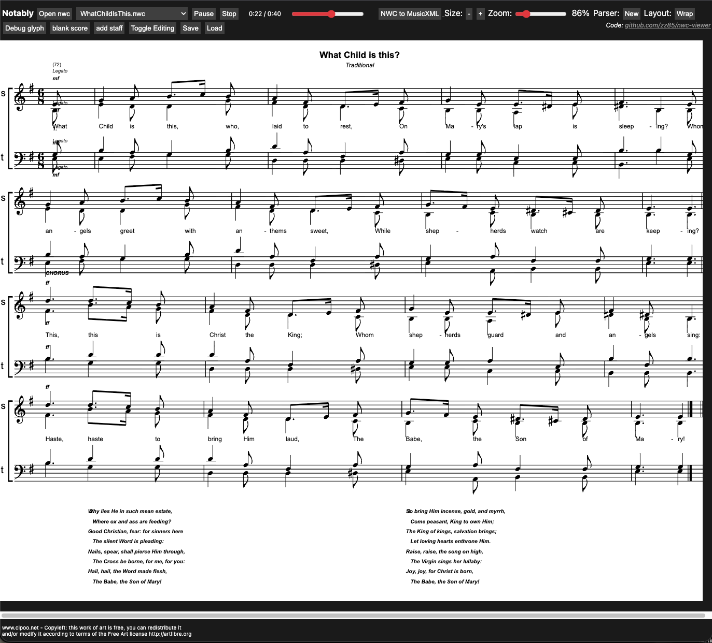

# Notably
Notably is a musical viewer and player for NWC ([Noteworthy Composer](http://noteworthycomposer.com)) files. It runs in browser so it has cross platform compatability and doesn't require any software installation. It attempts to parse multiple version of nwc files (v1.5, v1.7, v2.75) and renders music notation. It usees browser based technologies like js, canvas and html.

If you encounter bugs, feel free to [submit an issue](https://github.com/zz85/nwc-viewer/issues) or a pull request.

And if you like this project, you can also chat me up [@blurspline on twitter](https://twitter.com/blurspline).

### [Try it](http://zz85.github.io/nwc-viewer/)



## Changelog

### v2.2 - March 2026
- **Wrap layout** with DP-optimal line breaking and anchor-point justification
- **Lyrics** — syllable assignment respecting slur/tie/LyricSyllable rules, inter-syllable dashes
- **Staff visual properties** — boundary-based spacing, bracket/brace chains, layering
- **SoundFont playback** — OxiSynth (Rust/WASM) with GM SoundFont, replacing musical.js
- **Playback controls** — play/pause, stop, progress bar, time display
- Beam, tie, and barline connector fixes
- Virtual viewport rendering with transform-based zoom
- 285 unit tests

### v2.0 - January 2026
- Refactored global variables to MusicContext pattern for better modularity
- Implemented proper beam support respecting NWC file beam markers
- Improved tie and slur rendering with better matching logic
- Added comprehensive error handling throughout parsing and rendering
- Improved layout spacing with logarithmic scale for better visual balance
- Added layout test suite (184 total tests)
- Fixed dotted note spacing for stem-up notes with flags
- Fixed quickDraw resize handling

### 5 May 2020
- Add support for loading nwc v1.55
- lyrics rendering
- add zoom scaling
- add canvas scrolling by dragging
- initial tie
- added debug glyph buttons

### v1 "MVP" 28 December 2017
[Basic opening of some nwc files](https://github.com/zz85/nwc-viewer/releases/tag/v1)
- open more nwc files (1.75, 2, 2.75/nwctext)
- musicial alignment
- music playback via musical.js with abc export
- more accurate font loading via opentype.js

### v0 "POC" 20 Nov 2017
Porting nwc2ly.py to js, basic notation rendering
- basic smufl font tests
- basic glyph renderings
- basic nwc file parsing

## Components
This project contains
- nwc file decoder, which includes a binary file reader / parser
- interpreter, that make sense of the notation objects
- musical notation rendering, using canvas and smufl font
- simple lilypond code exporter
- **CLI tool** for parsing NWC files to JSON (see `bin/nwc-parse.js`)
- **NWC to MusicXML converter** - library, CLI tool, and web interface (see `lib/nwc2xml/`)

## CLI Tools

### Parse NWC to JSON

```bash
# Parse to JSON
bun bin/nwc-parse.js file.nwc

# Pretty print
bun bin/nwc-parse.js --pretty file.nwc

# Save to file
bun bin/nwc-parse.js file.nwc > output.json
```

See [bin/README.md](bin/README.md) for more details.

### Convert NWC to MusicXML

```bash
# Convert to MusicXML
bun bin/nwc2xml.js song.nwc

# Specify output file
bun bin/nwc2xml.js song.nwc output.xml
```

See [lib/nwc2xml/README.md](lib/nwc2xml/README.md) for more details.

## Web Tools

- **[index.html](index.html)** - Music viewer and player for NWC files
- **[nwc2xml_converter.html](nwc2xml_converter.html)** - NWC to MusicXML converter with drag-and-drop interface

## Internals

```
Parse Binary NWC => Tokens => Interpret => Scoring (Typesetting) => Drawing
```

### mrds customizations (integrated in mrds project)

When used via `?file=` parameter (embedded mode):

- **Korean title/lyrics**: Google Fonts Noto Sans KR; EUC-KR/CP949 decoding; lyric font stack
- **Zoom 25%~100%**: Default 25% for more measures per line; slider limited to this range
- **Voice selector**: Choose staff/part to play; selected staff highlighted in blue
- **Playback sync**: Red vertical line at current position; tempo base conversion; auto-scroll

---

This project follows much of the data structure of nwc files for simplicity.

A piece of music can be loaded either from a nwc file or from a blank slate.
When loading from a nwc file, it is parsed and converted into tokens.

These tokens are simple plain-old javascript / JSON objects. They are like AST tokens that can be processed pretty similarly to javascript parsing libs like esprima/acorn. They are data only and have no functions/classes. This allows flexibility in the processing, editing, manipulation of the tokens, without a lock in to an input API. In theory it would be simple to add new importers.

The tokens gets passed through a interpreter. These runs through the tokens and interpret them musically, deriving musical time values and absolute musical pitches for the objects.

Next, the scoring engine picks up the tokens and maps them to appropriate drawing symbols. It also lays them out and attach coordinates to the drawing objects.

Finally, the drawing system runs through all graphical objects and renders them on screen.

### API

####  1. NWC parsing
```
decodeNwcArrayBuffer(bytearray)
```
(nwc.js) takes in a bytearray and returns an data object with the interpretation of the nwc contents.

####  2. Musical intepretation
(interpreter.js) uses SightReader to assign cumulative time values to notes. It also translate positions into musical values. The input tokens are modified in place with new properties.

#### 3. Notation representation
(typeset.js) attempts to score the music by generating graphical tokens and calculating necessary adjustments.

#### 4. Rendering
(drawing.js) takes the graphical objects and renders them to a canvas target.

### External Libs
- inflate.js - zlib inflating for nwc binary format
- bravura font - smufl music font
- soundfont-engine - SoundFont synthesizer with OxiSynth (Rust/WASM) backend
- opentype.js - font loading

## NWC File Format
I wrote a nwc parser/converter back in 2005 [nwc2ly.py](https://github.com/zz85/nwc2ly.py) using the "french cafe approach". The decoder used here was initially a port of the python version with additions to support versions 2.7 and nwctext.
